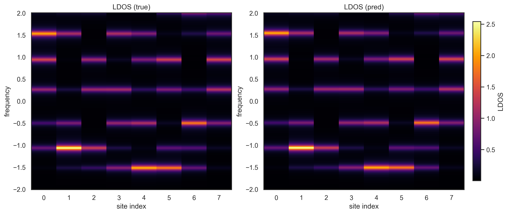

# Hamiltonian-learning-using-neural-networks

# ML Fidelity vs Noise — Skills Demo

This repository contains a small **machine learning demo** in condensed matter physics:  
predicting real onsite energies of a 1D chain and comparing **predicted vs true spectral densities**.  
The jupyter notebook includes the necessary functions to make the training and testing data of the neural network, the neural network, and also a code layout to study the robustness of neural netowrk, it is studied using the quantity called fidelity. The jupyter file has comments throughout the file for easy explanation.
---

## 📖 Contents
- `real_onsite_enery_learning.ipynb` – Jupyter notebook with full workflow
- `results/` – saved plots used in this README
- `requirements.txt` – dependencies for reproducibility
- `.gitignore` – ignores caches, data, checkpoints

---

## ⚡ Demo Results

### Fidelity vs Noise
Shows how prediction fidelity drops as input noise increases when there is overfitting of training data.


Shows how prediction fidelity drops as input noise increases when we remove overfitting of training data by using a different neural network.


### LDOS Comparison
True vs predicted local density of states (LDOS) for one test sample without any noise.


True vs predicted local density of states (LDOS) for one test sample with noise of strength $0.2$ with overfitting.


True vs predicted local density of states (LDOS) for one test sample with noise of strength $0.2$ without overfitting.


### Predicted vs True Onsite Energies
Scatter plot with regression line.


---

## 🚀 Quickstart

Clone this repository and install dependencies:

```bash
git clone https://github.com/<your-username>/ml-fidelity-demo.git
cd ml-fidelity-demo
python -m venv venv && source venv/bin/activate
pip install -r requirements.txt
