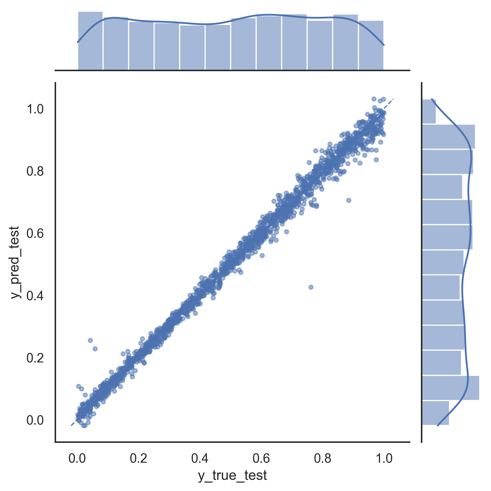
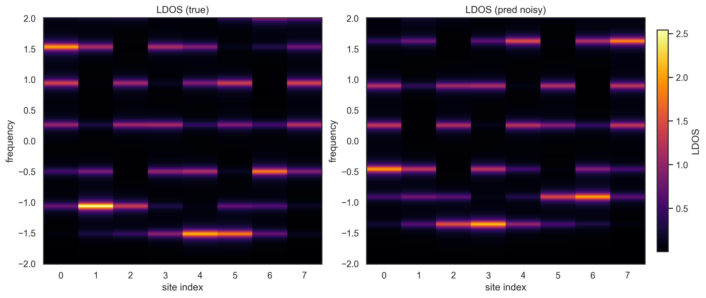

# Hamiltonian Learning using Neural Networks

## ML Fidelity vs Noise — Skills Demo


<!-- CI badge (works after you add .github/workflows/tests.yml) -->
<!--  -->
This project shows how a neural network can learn the “fingerprint” of a material and predict how it behaves when we change its properties.

This repository contains a **machine learning demo** in condensed matter physics:  
predicting real onsite energies of a 1D tight-binding chain and comparing **spectral densities (local density of states, LDOS) for predicted vs true Hamiltonian parameters**.

The Jupyter notebook includes:
- data generation functions for training and testing,
- a simple neural network model (Keras/TensorFlow),
- a framework to study robustness of predictions against noise using **fidelity** as a metric,
- inline comments throughout to make the workflow easy to follow.

---

## 📖 Contents
- `real_onsite_energy_learning.ipynb` – main Jupyter notebook
- `results/` – saved plots used in this README
- `requirements.txt` – dependencies for reproducibility
- `.gitignore` – ignores caches, data, checkpoints

---

## ⚡ Demo Results

### Predicted vs True Onsite Energies (no noise)
Scatter plot with regression line.


---

### LDOS Comparisons
Local density of states (LDOS) for a single test sample:

- Without noise  
  

- With noise strength = 0.2, **with overfitting**  
  

- With noise strength = 0.2, **without overfitting**  
  

---

### Fidelity vs Noise

- With overfitting  
  

- Without overfitting (improved network)  
  

---
## Tests
Run the test suite:

```bash
pytest -q
```
---
## 🚀 Quickstart

Clone this repository and install dependencies:

```bash
git clone https://github.com/pereira-elizabeth/Hamiltonian-learning-using-neural-networks.git
cd Hamiltonian-learning-using-neural-networks
python -m venv venv && source venv/bin/activate   # Windows: venv\Scripts\Activate.ps1
pip install -r requirements.txt
